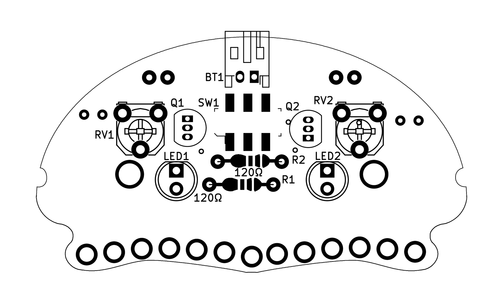
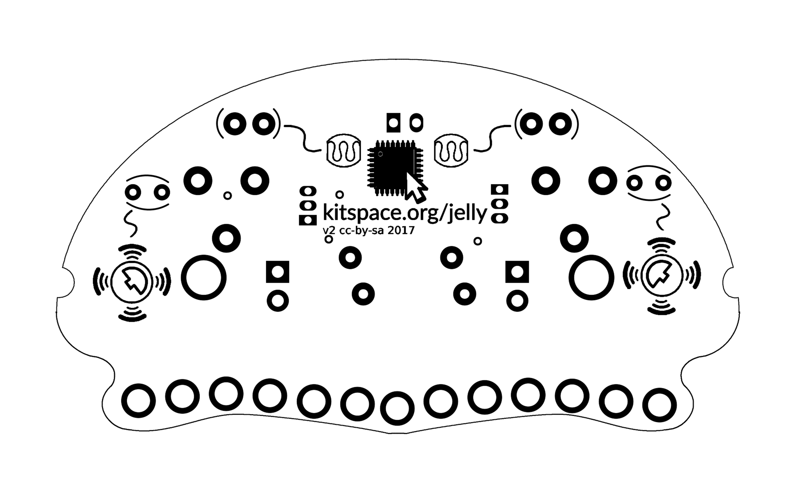

# Light-following Jellyfish Bristlebot

This is a small light following robot that consists of a simple analog circuit and uses pager vibration motors and toothbrush heads as a form of locomotion. 
This was heavily inspired by [Facelessloser's project](https://facelesstech.wordpress.com/2016/08/15/light-following-bristle-bot/) but adds jellyfishness (with the help of [svg2mod](https://github.com/mtl/svg2mod)).

## Parts
You can buy most of the parts through the [Kitspace page](https://kitspace.org/jelly) but you will also need:

- 2 toothbrush heads (use some old ones!)
- A LiPo battery with a JST connector and built-in protection, anything between 200 - 400mAh should work well (e.g. [from Adafruit](https://www.adafruit.com/product/2750)
- 2 pager vibration motors (e.g. [from Amazon](https://www.amazon.co.uk/Vibration-Motor-TOOGOO-4-6mm-2000RPM/dp/B01H01PXQ2))
- 3 100mm cable ties (e.g. [from Amazon](https://www.amazon.co.uk/Sealey-CT25101-Cable-Ties-100mm/dp/B000RO146I))

## Instructions

